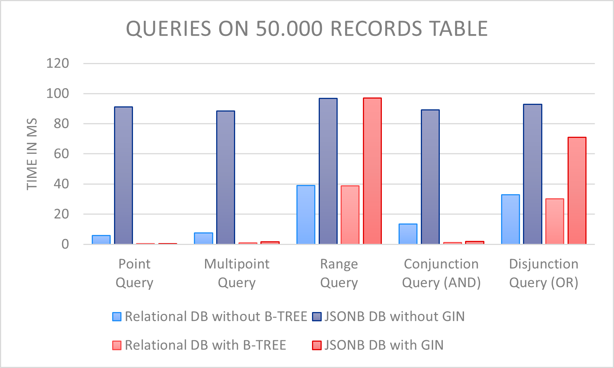
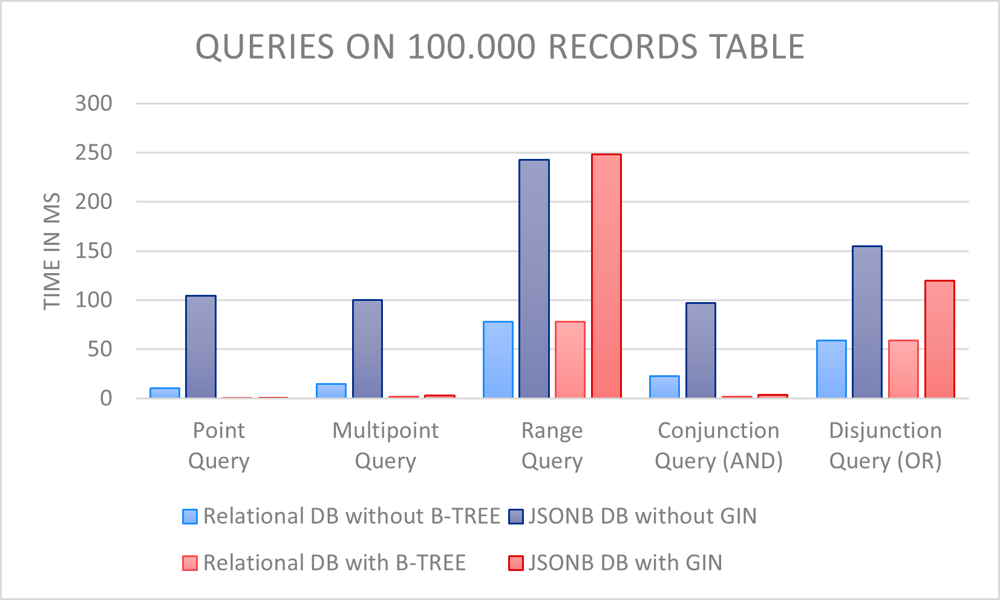
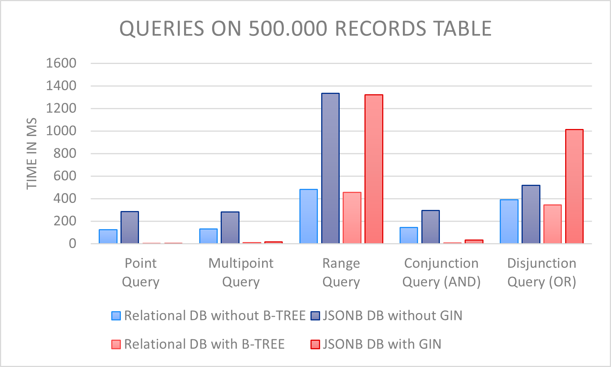
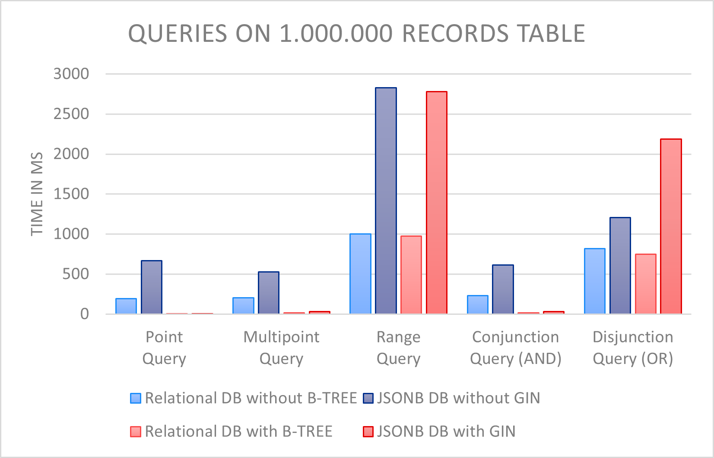
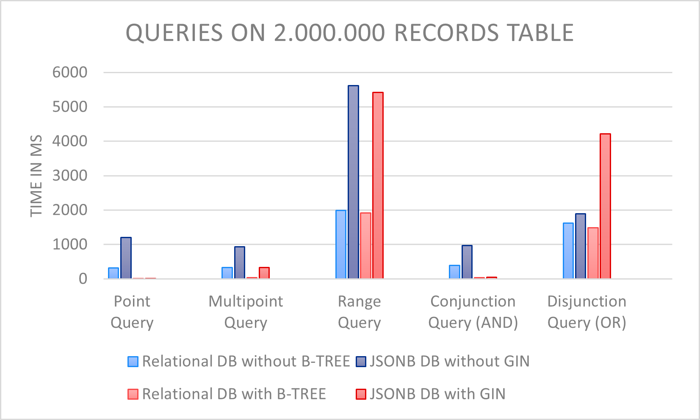
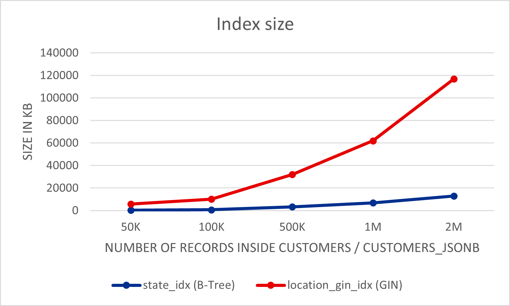
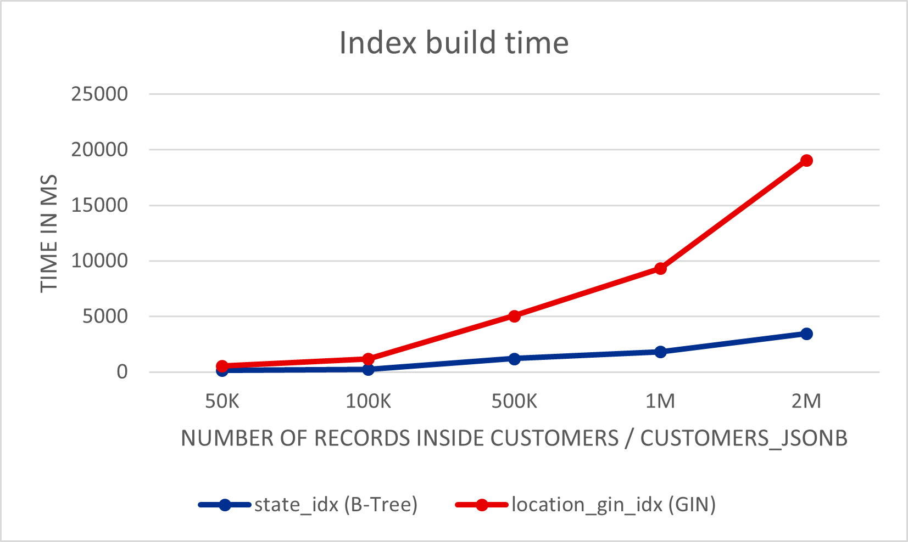

# POSTGRESQL BENCHMARK BETWEEN RELATIONAL AND JSONB DATABASES
Data modelling influences the optimisation possibilities. Thus, a JSON document is a "black box" in which queries cannot really be optimised. With PG JSONB, on the other hand, an attempt is made to analyse JSONB documents and thus also to optimise them. However, this also has its limits. These limits are to be determined and demonstrated in the following benchmark.
The benchmark considers two databases: a relational database with common types and a database with nested JSONB objects. To determine meaningful values for data sets of different sizes, both databases were examined for 50K, 100K, 500K, 1M and 2M records, respectively. The databases were benchmarked without an index and with the B-tree index, which references the records of the relational database, and with the GIN index, which references the records of the JSONB database. 
The benchmark is intended to determine whether there are disadvantages about the performance of a database with nested attributes as JSONB objects. For this purpose, the performance of both databases was tested, analysed, and compared using various queries and operations.
The following queries and operations were tested for this purpose:
*	I Point Query
*	II Multipoint Query
*	III Range Query
*	IV Conjunction Query
*	V Disjunction Query
*	INSERT
*	UPDATE
* DELETE

To test these queries and operations the benchmark uses the “Dell DVD Store Database Test Suite” to generate different sizes of an example database (https://github.com/dvdstore/ds21/blob/master/ds2). In this example database the CUSTOMERS table is used for the relational database benchmark and the CUSTOMERS_JSONB table is used for the jsonb database benchmark. The CUSTOMERS_JSONB table is generated dynamically inside the benchmark according to the chosen size.

## TABLE OF CONTENTS
1.	Requirements
2.	Installation
3.	Configuration and usage
4.	Directories and files
5.	Documentation
6.	Results of the benchmark
7.	Conclusion 

## REQUIREMENTS
-	Windows OS to run the .bat files
-	Installation of the “Dell DVD Store Database Test Suite” (https://linux.dell.com/dvdstore/) for the generic database generation, see chapter CONFIGURATION

## INSTALLATION
-	Navigate into your C:\ drive:
```bash
cd C:\
```
-	Clone repository:
```bash
git clone https://github.com/4realDev/psql-relational-vs-jsonb-benchmark.git
```
## CONFIGURATION AND USAGE
-	For the Benchmark the “Dell DVD Store Database Test Suite” is used. This is an open source simulation of an online ecommerce site with implementations in Microsoft SQL Server, Oracle, MySQL and PostgresSQL along with driver programs and web applications. This Suite is used to generate five different databases with similar data and data distribution.

-	For an installing guide please refer to the readme.txt on the official GitHub repository (https://github.com/dvdstore/ds21/blob/master/ds2/ds2.1_Documentation.txt).
The result inside the ds2 folder should look like this:
 	 

-	Use the Install_DVDStore.pl script in the root directory to generate the CSV files for the five ds2 benchmark databases with the size of:

### **Database size	Records inside Customers table**

| 25 MB	    | 50 K      |
|:---------:|:---------:|
| **50 MB**	| **100 K** |
| **250 MB**| **500 K** |
| **500 MB**| **1M**    |
| **1 GB**	 | **2M**    |

- To start the generic database generation with the ds2 tool, we need execute the pgsqlds2_create_all.sh shell script in the ds2\pgsqlds2 directory of the ds21 repository. But since the benchmark is on WINDOWS, and the repository only provides a shell script for LINUX, this would not work. Therefore, small adjustments were made on the script, to convert it into a batch (.bat) script. This batch script can be found in the root directory of this repository under the name adjusted_pgsqlds2_create_all.bat. Copy paste this script into the same directory where the pgsqlds2_create_all.sh script is and execute the adjusted_pgsqlds2_create_all.bat script instead of the pgsqlds2_create_all.sh script.

- Before execution make sure that no one uses the databases and all the connections to the databases are closed.

### **The adjustments made to the pgsqlds2_create_all.sh to convert it into the adjusted_pgsqlds2_create_all.bat are the following:**

1. Adjust the shell syntax to the batch script to make it work on WINDOWS
2. Commenting out the pgsqlds2_create_ind.sql file, which is responsible for the index creation in the generated benchmark database benchmark, as the benchmark first tests the generated database without any indexes, and only then creates its OWN indexes (B-Tree and GIN), with which the database is tested again.
3.	Enter the path, where you cloned this repository and directly run the benchmark (execute the run-benchmark.sql) on the generated database, after it has generated.

Through this adjustments is it possible to only call one run script to execute the database generation, as well as the benchmark.
 
## DIRECTORIES AND FILES
Within the download you will find the following directories and files, logically grouping common .sql and .bat scripts. You will see something like this:

```text
C:
|   adjusted_pgsqlds2_create_all.bat
|   cache-fill.sql
|   convert-relational-db-into-jsonb-db.sql
|   create-cache-fill-table.sql
|   ignore.txt
|   LICENSE
|   README.md
|   run-benchmark.sql
|   
+---jsonb-db
|   |   jsonb-db__delete.sql
|   |   jsonb-db__gin-index-creation.sql
|   |   jsonb-db__I-point-query.sql
|   |   jsonb-db__II-multipoint-query.sql
|   |   jsonb-db__III-range-query.sql
|   |   jsonb-db__insert.sql
|   |   jsonb-db__IV-conjunction-query.sql
|   |   jsonb-db__update.sql
|   |   jsonb-db__V-disjunction-query.sql
|   |   
|   \---results
|           jsonb-db__I-point-query-with-gin-index.txt
|           jsonb-db__I-point-query-without-index.txt
|           jsonb-db__II-multipoint-query-with-gin-index.txt
|           jsonb-db__II-multipoint-query-without-index.txt
|           jsonb-db__III-range-query-with-gin-index.txt
|           jsonb-db__III-range-query-without-index.txt
|           jsonb-db__IV-conjunction-query-with-gin-index.txt
|           jsonb-db__IV-conjunction-query-without-index.txt
|           jsonb-db__V-disjunction-query-with-gin-index.txt
|           jsonb-db__V-disjunction-query-without-index.txt
|           
\---relational-db
    |   relational-db__btree-index-creation.sql
    |   relational-db__delete.sql
    |   relational-db__I-point-query.sql
    |   relational-db__II-multipoint-query.sql
    |   relational-db__III-range-query.sql
    |   relational-db__insert.sql
    |   relational-db__IV-conjunction-query.sql
    |   relational-db__update.sql
    |   relational-db__V-disjunction-query.sql
    |   
    \---results
            relational-db__I-point-query-with-btree-index.txt
            relational-db__I-point-query-without-index.txt
            relational-db__II-multipoint-query-with-btree-index.txt
            relational-db__II-multipoint-query-without-index.txt
            relational-db__III-range-query-query-with-btree-index.txt
            relational-db__III-range-query-query-without-index.txt
            relational-db__IV-conjunction-query-with-btree-index.txt
            relational-db__IV-conjunction-query-without-index.txt
            relational-db__V-disjunction-query-with-btree-index.txt
            relational-db__V-disjunction-query-without-index.txt
```

## DOCUMENTATION
### Explaining of the important Files and Folders

#### adjusted_pgsqlds2_create_all.bat

Starts the generic database generation directly with the benchmark (run-benchmark.sql) in the ds2 tool on WINDOWS. Needs to be copied and pasted into the same directory where the pgsqlds2_create_all.sh script from the ds2 GitHub Repo is.

#### run-benchmark.sql
*Start script for the benchmark. 
Creates the CUSTOMERS_JSONB table by converting the CUSTOMERS table with the convert-relational-db-into-jsonb-db script. Creates the cache-fill-table with the create-cache-fill-table.sql script. Fills the cache before every query and operation with the cache-fill.sql script. Calls all the queries, insert, delete, and update operations and fills the cache with cache-fill.sql before every query or operation script.*

#### convert-relational-db-into-jsonb-db.sql
*Converts the CUSTOMERS relational data table into the CUSTOMERS_JSONB jsonb data table.*

#### create-cache-fill-table.sql
*Generates a random table with the same amount of records as chosen for the CUSTOMERS table.*

#### cache-fill.sql
*Selects all elements from the created cache-fill-table to override the cache before any query I-V, insert, delete or update operation. Ensures no caching of previous results.*

#### relational-db folder
*Includes all .sql scripts for index creation of the B-Tree-Index, the different queries (I-V) and the insert, delete and update operation regarding the relational database.*

#### jsonb-db folder
*Includes all .sql scripts for index creation of the GIN-Index, the different queries (I-V) and the insert, delete and update operation regarding the jsonb-db database.*

### results folder in jsonb-db and relational-db
*Stores the EXPLAIN ANALYZE output of the query planner with the results from the queries (I-V) and the insert, delete and update operation.*
 
## QUERIES
The EXPLAIN ANALYZE results of the Query Planner for the queries with and without an index for both the tables, json and relational, will be generated dynamically every time the benchmark is executed.

**These results are saved inside .txt files in the folders:**
-	psql-relational-vs-jsonb-benchmark\relational-db\results for the Queries on the relational CUSTOMERS table
-	psql-relational-vs-jsonb-benchmark\jsonb-db\results for the Queries on the jsonb CUSTOMERS_jSONB table.

**Attention: These results will be overwritten every time the benchmark is executed.**

The queries and their query plan are shown below. To simplify matters, only the query plans of the queries that refer to the CUSTOMERS / CUSTOMERS_JSONB table with 1,000,000 records were used. 

---
### POINT QUERY
#### relational-db/ relational-db__I-point-query.sql:
``` sql
SELECT
    firstname,
    lastname,
    gender,
    age
FROM
    customers
WHERE
    firstname = 'VKUUXF'
    AND lastname = 'ITHOMQJNYX';
```

**Query Plan without Index:**
``` text
Gather  (cost=1000.00..29740.10 rows=1 width=16) (actual time=184.855..193.285 rows=0 loops=1)
   Workers Planned: 2
   Workers Launched: 2
   ->  Parallel Seq Scan on customers  (cost=0.00..28740.00 rows=1 width=16) (actual time=125.313..125.313 rows=0 loops=3)
         Filter: (((firstname)::text = 'VKUUXF'::text) AND ((lastname)::text = 'ITHOMQJNYX'::text))
         Rows Removed by Filter: 333333
 Planning Time: 0.444 ms
 Execution Time: 193.316 ms
```

**Query Plan with B-Tree Index:**
``` text
Index Scan using firstname_lastname_idx on customers  (cost=0.42..6.19 rows=1 width=16) (actual time=0.075..0.075 rows=0 loops=1)
   Index Cond: (((firstname)::text = 'VKUUXF'::text) AND ((lastname)::text = 'ITHOMQJNYX'::text))
 Planning Time: 2.075 ms
 Execution Time: 0.092 ms
 ```

#### jsonb-db/jsonb-db__I-point-query.sql:
``` sql
SELECT
    personal #> '{personal, name}' ->> 'firstname' AS "firstname",
    personal #> '{personal, name}' ->> 'lastname' AS "lastname",
    personal -> 'personal' ->> 'gender' AS "gender",
    personal -> 'personal' ->> 'age' AS "age"
FROM
    customers_jsonb
WHERE
    personal@> '{"personal": {"name": {"firstname": "VKUUXF"}}}'
    AND personal@> '{"personal": {"name": {"lastname": "ITHOMQJNYX"}}}';
```

**Query Plan without Index:**
``` text
Gather  (cost=1000.00..98860.56 rows=378 width=128) (actual time=940.580..1081.836 rows=0 loops=1)
   Workers Planned: 2
   Workers Launched: 2
   ->  Parallel Seq Scan on customers_jsonb  (cost=0.00..97822.76 rows=158 width=128) 
       (actual time=885.136..885.136 rows=0 loops=3)
         Filter: ((personal @> '{"personal": {"name": {"firstname": "VKUUXF"}}}'::jsonb) 
         AND (personal @> '{"personal": {"name": {"lastname": "ITHOMQJNYX"}}}'::jsonb))
         Rows Removed by Filter: 333333
 Planning Time: 0.384 ms
 Execution Time: 1081.858 ms
```
 
**Query Plan with GIN-Index:**
``` text
Bitmap Heap Scan on customers_jsonb  (cost=37.02..429.51 rows=100 width=128) (actual time=0.485..0.486 rows=0 loops=1)
   Recheck Cond: ((personal @> '{"personal": {"name": {"firstname": "VKUUXF"}}}'::jsonb) 
   AND (personal @> '{"personal": {"name": {"lastname": "ITHOMQJNYX"}}}'::jsonb))
   ->  Bitmap Index Scan on personal_gin_idx  (cost=0.00..37.00 rows=100 width=0) 
       (actual time=0.483..0.483 rows=0 loops=1)
         Index Cond: ((personal @> '{"personal": {"name": {"firstname":"VKUUXF"}}}'::jsonb) 
         AND (personal @> '{"personal": {"name": {"lastname": "ITHOMQJNYX"}}}'::jsonb))
 Planning Time: 1.187 ms
 Execution Time: 0.526 ms
```

---

### MULTI POINT QUERY
#### relational-db__II-multipoint-query.sql:

``` sql
SELECT
    firstname,
    lastname,
    gender,
    age
FROM
    customers
WHERE
    state = 'SD';
```

**Query Plan without Index:**
``` text
Gather  (cost=1000.00..29571.63 rows=8733 width=16) (actual time=0.389..215.115 rows=9720 loops=1)
   Workers Planned: 2
   Workers Launched: 2
   ->  Parallel Seq Scan on customers  (cost=0.00..27698.33 rows=3639 width=16) (actual time=0.221..147.784 rows=3240 loops=3)
         Filter: ((state)::text = 'SD'::text)
         Rows Removed by Filter: 330093
 Planning Time: 0.084 ms
 Execution Time: 215.678 ms
```

**Query Plan with B-Tree Index:**
``` text
Bitmap Heap Scan on customers  (cost=100.11..16952.34 rows=8733 width=16) (actual time=2.125..84.251 rows=9720 loops=1)
   Recheck Cond: ((state)::text = 'SD'::text)
   Heap Blocks: exact=6526
   ->  Bitmap Index Scan on state_idx  (cost=0.00..97.92 rows=8733 width=0) (actual time=1.404..1.405 rows=9720 loops=1)
         Index Cond: ((state)::text = 'SD'::text)
 Planning Time: 0.125 ms
 Execution Time: 85.179 ms
```

#### jsonb-db__II-multipoint-query.sql:
``` sql
SELECT
    personal #> '{personal, name}' ->> 'firstname' AS "firstname",
    personal #> '{personal, name}' ->> 'lastname' AS "lastname",
    personal -> 'personal' ->> 'gender' AS "gender",
    personal -> 'personal' ->> 'age' AS "age"
FROM
    customers_jsonb
WHERE
    location@> '{"location": {"state": "SD"}}';
```

**Query Plan without Index:**
``` text
Gather  (cost=1000.00..98977.24 rows=37830 width=128) (actual time=1.113..525.799 rows=9720 loops=1)
   Workers Planned: 2
   Workers Launched: 2
   ->  Parallel Seq Scan on customers_jsonb  (cost=0.00..94194.24 rows=15762 width=128) 
         (actual time=0.537..457.062 rows=3240 loops=3)
         Filter: (location @> '{"location": {"state": "SD"}}'::jsonb)
         Rows Removed by Filter: 330093
 Planning Time: 0.070 ms
 Execution Time: 526.301 ms
```

**Query Plan with GIN-Index:**
``` text
Bitmap Heap Scan on customers_jsonb  (cost=109.50..27921.33 rows=10000 width=128) (actual time=3.132..474.290 rows=9720 loops=1)
   Recheck Cond: (location @> '{"location": {"state": "SD"}}'::jsonb)
   Heap Blocks: exact=8586
   ->  Bitmap Index Scan on location_gin_idx  (cost=0.00..107.00 rows=10000 width=0) 
       (actual time=2.072..2.073 rows=9720 loops=1)
         Index Cond: (location @> '{"location": {"state": "SD"}}'::jsonb)
 Planning Time: 0.131 ms
 Execution Time: 475.451 ms
```
---

### RANGE QUERY
#### relational-db__III-range-query.sql:
``` sql
SELECT
    firstname,
    lastname,
    gender,
    age
FROM
    customers
WHERE
    age >= 26;
```

**Query Plan without Index:**
``` text
Seq Scan on customers  (cost=0.00..34990.00 rows=891200 width=16) (actual time=0.037..472.670 rows=890480 loops=1)
   Filter: (age >= 26)
   Rows Removed by Filter: 109520
 Planning Time: 0.072 ms
 Execution Time: 493.882 ms
```

**Query Plan with B-Tree Index:**
``` text
Seq Scan on customers  (cost=0.00..34990.00 rows=891200 width=16) (actual time=0.016..427.989 rows=890480 loops=1)
   Filter: (age >= 26)
   Rows Removed by Filter: 109520
 Planning Time: 0.574 ms
 Execution Time: 449.410 ms
```

**jsonb-db__III-range-query.sql:**
``` sql
SELECT
    personal #> '{personal, name}' ->> 'firstname' AS "firstname",
    personal #> '{personal, name}' ->> 'lastname' AS "lastname",
    personal -> 'personal' ->> 'gender' AS "gender",
    personal -> 'personal' ->> 'age' AS "age"
FROM
    customers_jsonb
WHERE
    personal -> 'personal' ->> 'age' >= '26';
```

**Query Plan without Index:**
``` text
Seq Scan on customers_jsonb  (cost=0.00..165597.92 rows=1260992 width=128) (actual time=0.058..2281.391 rows=890480 loops=1)
   Filter: (((personal -> 'personal'::text) ->> 'age'::text) >= '26'::text)
   Rows Removed by Filter: 109520
 Planning Time: 0.057 ms
 Execution Time: 2306.498 ms
```

**Query Plan with GIN-Index:**
``` text
Seq Scan on customers_jsonb  (cost=0.00..98342.66 rows=333333 width=128) (actual time=0.032..2250.314 rows=890480 loops=1)
   Filter: (((personal -> 'personal'::text) ->> 'age'::text) >= '26'::text)
   Rows Removed by Filter: 109520
 Planning Time: 0.078 ms
 Execution Time: 2274.686 ms
```
---
### CONJUNCTION QUERY
#### relational-db__IV-conjunction-query.sql:
``` sql
SELECT
    firstname,
    lastname,
    gender,
    age
FROM
    customers
WHERE
    age = 26
    AND gender = 'F'
```

**Query Plan without Index:**
``` text
Gather  (cost=1000.00..30444.60 rows=7046 width=16) (actual time=0.385..251.849 rows=6920 loops=1)
   Workers Planned: 2
   Workers Launched: 2
   ->  Parallel Seq Scan on customers  (cost=0.00..28740.00 rows=2936 width=16) (actual time=0.398..178.343 rows=2307 loops=3)
         Filter: ((age = 26) AND ((gender)::text = 'F'::text))
         Rows Removed by Filter: 331027
 Planning Time: 0.105 ms
 Execution Time: 252.271 ms
```

**Query Plan with B-Tree Index:**
``` text
Bitmap Heap Scan on customers  (cost=68.64..15030.45 rows=7046 width=16) (actual time=1.774..55.900 rows=6920 loops=1)
   Recheck Cond: ((age = 26) AND ((gender)::text = 'F'::text))
   Heap Blocks: exact=5981
   ->  Bitmap Index Scan on age_below_twenty_six_gender_female_idx  (cost=0.00..66.88 rows=7046 width=0) (actual time=1.149..1.150 rows=6920 loops=1)
 Planning Time: 0.146 ms
 Execution Time: 56.311 ms
```

#### jsonb-db__IV-conjunction-query.sql:
``` sql
SELECT
    personal #> '{personal, name}' ->> 'firstname' AS "firstname",
    personal #> '{personal, name}' ->> 'lastname' AS "lastname",
    personal -> 'personal' ->> 'gender' AS "gender",
    personal -> 'personal' ->> 'age' AS "age"
FROM
    customers_jsonb
WHERE
    personal@> '{"personal": {"age": 26}}'
    AND personal@> '{"personal": {"gender": "F"}}';
```

**Query Plan without Index:**
``` text
Gather  (cost=1000.00..98860.56 rows=378 width=128) (actual time=0.626..552.927 rows=6920 loops=1)
   Workers Planned: 2
   Workers Launched: 2
   ->  Parallel Seq Scan on customers_jsonb  (cost=0.00..97822.76 rows=158 width=128) 
       (actual time=0.402..480.538 rows=2307 loops=3)
         Filter: ((personal @> '{"personal": {"age": 26}}'::jsonb) 
         AND (personal @> '{"personal": {"gender": "F"}}'::jsonb))
         Rows Removed by Filter: 331027
 Planning Time: 0.350 ms
 Execution Time: 553.394 ms
```

**Query Plan with GIN-Index:**
``` text
Bitmap Heap Scan on customers_jsonb  (cost=37.02..429.51 rows=100 width=128) (actual time=8.380..616.400 rows=6920 loops=1)
   Recheck Cond: ((personal @> '{"personal": {"age": 26}}'::jsonb) 
   AND (personal @> '{"personal": {"gender": "F"}}'::jsonb))
   Heap Blocks: exact=6642
   ->  Bitmap Index Scan on personal_gin_idx  (cost=0.00..37.00 rows=100 width=0) 
       (actual time=7.496..7.496 rows=6920 loops=1)
         Index Cond: ((personal @> '{"personal": {"age": 26}}'::jsonb) 
         AND (personal @> '{"personal": {"gender": "F"}}'::jsonb))
 Planning Time: 0.411 ms
 Execution Time: 617.044 ms
```

### DISJUNCTION QUERY
#### relational-db__V-disjunction-query.sql:
``` sql
SELECT
    firstname,
    lastname,
    gender,
    age
FROM
    customers
WHERE
    age = 26
    OR gender = 'F';
```

**Query Plan without Index:**
``` text
Seq Scan on customers  (cost=0.00..37490.00 rows=505621 width=16) (actual time=0.045..508.814 rows=506618 loops=1)
   Filter: ((age = 26) OR ((gender)::text = 'F'::text))
   Rows Removed by Filter: 493382
 Planning Time: 0.077 ms
 Execution Time: 521.733 ms
```

**Query Plan with B-Tree Index:**
``` text
Bitmap Heap Scan on customers  (cost=4404.81..34532.86 rows=509203 width=16) (actual time=30.487..271.310 rows=506618 loops=1)
   Recheck Cond: ((age = 26) OR ((gender)::text = 'F'::text))
   Heap Blocks: exact=22490
   ->  Bitmap Index Scan on age_above_twenty_six_or_gender_female_idx  
       (cost=0.00..4277.51 rows=509203 width=0) 
       (actual time=27.613..27.614 rows=506618 loops=1)
 Planning Time: 0.149 ms
 Execution Time: 283.255 ms
```

#### jsonb-db__V-disjunction-query.sql:
``` sql
SELECT
    personal #> '{personal, name}' ->> 'firstname' AS "firstname",
    personal #> '{personal, name}' ->> 'lastname' AS "lastname",
    personal -> 'personal' ->> 'gender' AS "gender",
    personal -> 'personal' ->> 'age' AS "age"
FROM
    customers_jsonb
WHERE
    personal@> '{"personal": {"age": 26}}'
    OR personal@> '{"personal": {"gender": "F"}}';
```

**Query Plan without Index:**
``` text
Gather  (cost=1000.00..106975.04 rows=75281 width=128) (actual time=0.425..878.729 rows=506618 loops=1)
   Workers Planned: 2
   Workers Launched: 2
   ->  Parallel Seq Scan on customers_jsonb  (cost=0.00..98446.94 rows=31367 width=128) 
       (actual time=0.233..738.660 rows=168873 loops=3)
         Filter: ((personal @> '{"personal": {"age": 26}}'::jsonb) 
         OR (personal @> '{"personal": {"gender": "F"}}'::jsonb))
         Rows Removed by Filter: 164461
 Planning Time: 0.066 ms
 Execution Time: 894.373 ms
```

**Query Plan with GIN-Index:**
``` text
Bitmap Heap Scan on customers_jsonb  (cost=223.83..45625.54 rows=19885 width=128) (actual time=60.209..2058.600 rows=506618 loops=1)
   Recheck Cond: ((personal @> '{"personal": {"age": 26}}'::jsonb) 
   OR (personal @> '{"personal": {"gender": "F"}}'::jsonb))
   Rows Removed by Index Recheck: 220644
   Heap Blocks: exact=41081 lossy=33091
   ->  BitmapOr  (cost=223.83..223.83 rows=19985 width=0) 
       (actual time=54.096..54.097 rows=0 loops=1)
         ->  Bitmap Index Scan on personal_gin_idx  (cost=0.00..106.94 rows=9992 width=0) 
             (actual time=2.661..2.661 rows=13709 loops=1)
               Index Cond: (personal @> '{"personal": {"age": 26}}'::jsonb)
         ->  Bitmap Index Scan on personal_gin_idx  (cost=0.00..106.94 rows=9992 width=0) 
             (actual time=51.434..51.434 rows=499829 loops=1)
               Index Cond: (personal @> '{"personal": {"gender": "F"}}'::jsonb)
 Planning Time: 0.105 ms
 Execution Time: 2074.577 ms
```

---
### CREATION OF THE JSONB TABLE CUSTOMERS_JSONB
#### QUERY

``` sql
CREATE table CUSTOMERS_JSONB as(
    SELECT
        customerid,
        jsonb_build_object('personal',
            jsonb_build_object(
                'name', jsonb_build_object('firstname', firstname, 'lastname', lastname),
                'gender', gender,
                'age', age,
                'income', income,
                'contact', jsonb_build_object('email', email, 'phone', phone)
            )
        ) as "personal",

        jsonb_build_object('location',
            jsonb_build_object(
                'address1', address1, 
                'address2', address2, 
                'city', city,
                'state', state,
                'zip', zip,
                'country', country,
                'region', region
            )
        ) as "location",

        jsonb_build_object(
            'creditcardtype', creditcardtype, 
            'creditcard', creditcard, 
            'creditcardexpiration', creditcardexpiration
        ) as "credit",

        jsonb_build_object(
            'username', username, 
            'password', password
        ) as "login"
        
    FROM CUSTOMERS
);
```

---
#### RELATIONAL DATABASE STRUCTURE 
```text
CUSTOMERID: [PK] integer 

FIRSTNAME: varchar(50)  
LASTNAME: varchar(50)

AGE: smallint
INCOME: integer 
GENDER: varchart(1)

EMAIL: varchar(50)  
PHONE: varchar(50) 

ADDRESS1: varchar(50)   
ADDRESS2: varchar(50)  
CITY: varchar(50)  
STATE: varchar(50)  
ZIP: varchar(9)   
COUNTRY: varchar(50)  
REGION: smallint

CREDITCARDTYPE: integer  
CREDITCARD: varchar(50)  
CREDITEXPIRATION: varchar(50)  

USERNAME: varchar(50)  
PASSWORD: varchar(50)  
login: {
  USERNAME, 
  PASSWORD
}
```

---
#### JSONB OBJECT STRUCTURE
``` text
customerid,
personal: {

  name: {
    firstname,
    lastname
  },

  gender,
  age,
  income,

  contact: {
    email,
    phone
  }
},

location: {
  address1, 
  address2, 
  city,
  state,
  zip,
  country,
  region
},

credit: {
  creditcardtype, 
  creditcard, 
  creditcardexpiration
},

login: {
  username, 
  password
}
```

---
### INDEX CREATION
``` sql
#### CREATE B-TREE INDEX FOR RELATIONAL DATABASE
CREATE INDEX firstname_lastname_idx ON customers USING btree (firstname, lastname);

CREATE INDEX state_idx ON customers USING btree(state); // Index used for comparing

CREATE INDEX age_above_twenty_six_idx ON customers USING btree(age) WHERE age >= 26;

CREATE INDEX age_above_twenty_six_or_gender_female_idx ON customers USING btree(age,gender)
    WHERE age = 26 OR gender='F';

CREATE INDEX age_above_twenty_six_gender_female_idx ON customers USING btree(age, gender) 
    WHERE age = 26 AND gender='F';

#### CREATE GIN INDEX FOR JSONB DATABASE
CREATE INDEX personal_gin_idx ON customers_jsonb USING GIN (personal jsonb_path_ops);

CREATE INDEX location_gin_idx ON customers_jsonb USING GIN (location jsonb_path_ops);
```

---
### INSERT, DELETE AND UPDATE OPERATIONS
#### INSERT RECORDS INTO THE RELATIONAL DB WITH B-TREE INDEX
``` sql
INSERT INTO customers(
    customerid, 
    firstname, 
    lastname, 
    address1, 
    address2, 
    city, 
    state, 
    zip, 
    country, 
    region, 
    email, 
    phone, 
    creditcardtype, 
    creditcard, 
    creditcardexpiration, 
    username, 
    password, 
    age, 
    income, 
    gender)
    WITH tmp as (SELECT MAX(customerid) as max FROM customers)
    SELECT
        g + tmp.max as customerid,

        substr(md5(random()::text), 1, 50),
        substr(md5(random()::text), 1, 50),

        substr(md5(random()::text), 1, 50),
        NULL,
        substr(md5(random()::text), 1, 50),
        substr(md5(random()::text), 1, 50),
        random()::integer * 99999,
        substr(md5(random()::text), 1, 50),
        random()::integer * 2,

        substr(md5(random()::text), 1, 50),
        substr(md5(random()::text), 1, 50),

        random()::integer * 5,
        substr(md5(random()::text), 1, 50),
        substr(md5(random()::text), 1, 50),

        substr(md5(random()::text), 1, 50),
        'password',

        random()::integer * 100,
        random()::integer * 100000,
        substr(md5(random()::text), 1, 1)
FROM tmp, generate_series(1,max) as g;
VACUUM ANALYZE
```

#### INSERT RECORDS INTO THE RELATIONAL DB WITH B-TREE INDEX
``` sql
INSERT INTO customers_jsonb(customerid, personal, location, credit, login)
WITH tmp as (SELECT MAX(customerid) as max FROM customers_jsonb)
SELECT
    g + tmp.max as customerid,
    jsonb_build_object(
        'age', random()::integer * 100,
        'name', jsonb_build_object(
            'lastname', substr(md5(random()::text), 1, 50),  
            'firstname', substr(md5(random()::text), 1, 50)
        ),  
        'gender', substr(md5(random()::text), 1, 1),
        'income', random()::integer * 100000,
        'contact', jsonb_build_object(
            'email', substr(md5(random()::text), 1, 50),
            'phone', substr(md5(random()::text), 1, 50)
        )
    ),
    
    jsonb_build_object(
        'zip', random()::integer * 99999,
        'city', substr(md5(random()::text), 1, 50),
        'state', substr(md5(random()::text), 1, 50),
        'region', random()::integer * 2,
        'country', substr(md5(random()::text), 1, 50),
        'address1', substr(md5(random()::text), 1, 50),
        'address2', NULL
    ),
    
    jsonb_build_object(
        'creditcard', substr(md5(random()::text), 1, 50),
        'creditcardtype', random()::integer * 5,
        'creditcardexpiration', substr(md5(random()::text), 1, 50)
    ),
    
    jsonb_build_object(
        'username', substr(md5(random()::text), 1, 50),
        'password', 'password'
    )
FROM tmp, generate_series(1,max) as g;
VACUUM ANALYZE
```

#### UPDATE RECORDS FROM THE RELATIONAL DB WITH B-TREE INDEX
``` sql
UPDATE customers SET region = 3, creditcardtype = 6
WHERE country = 'China';
VACUUM ANALYZE
```

#### UPDATE RECORDS FROM THE JSONB DB WITH GIN INDEX
``` sql
UPDATE 
    customers_jsonb SET location = jsonb_set(location, '{location}', 
    location->'location' || '{"region": "3"}'),
    credit = jsonb_set(credit, '{creditcardtype}', '6')
WHERE location@>'{"location": {"country": "China"}}';
VACUUM ANALYZE
```

#### DELETE RECORDS FROM THE RELATIONAL DB WITH B-TREE INDEX
``` sql
DELETE FROM CUSTOMERS
WHERE customerid > (SELECT ((COUNT(*)/2)) FROM CUSTOMERS);
```

#### DELETE RECORDS FROM THE JSONB DB WITH GIN INDEX
``` sql
DELETE FROM CUSTOMERS_JSONB
WHERE customerid > (SELECT ((COUNT(*)/2)) FROM CUSTOMERS_JSONB);
```

## **RESULTS OF THE BENCHMARK**
**Disclaimer on the Index build time and Index size:**

For the index build time and size I took the index for the multipoint query as reference.

As a reminder, the multipoint query asks for all the records, where the state = “SD”.

For the relation CUSTOMERS table, the B-Tree index could reference the state column directly

(CREATE INDEX state\_idx ON customers USING btree(state);).

For the jsonb CUSTOMERS\_JSONB table, the GIN index had to reference “location”, which is an nested JSONB object, storing the state as well as multiple other attributes (address1, address2, city, state, zip, country, region)

(CREATE INDEX location\_gin\_idx ON customers\_jsonb USING GIN (location jsonb\_path\_ops);).

Therefore, the GIN index needs more build time and has a larger index size.

### ***50.000 RECORDS***

|<p>***Databases***</p><p>***Criteria***</p>|<p>Relational DB</p><p>without B-TREE</p>|<p>JSONB DB</p><p>without GIN</p>|<p>Relational DB</p><p>with B-TREE</p>|<p>JSONB DB</p><p>with GIN</p>|
| :-: | :-: | :-: | :-: | :-: |
|**Index build time**|-|-|136.652|526.053|
|**Index size**|-|-|360 kB|5912 kB|
|**Point Query**|5.83|91.19|0.35|0.36|
|**Multipoint Query**|7.47|88.53|1|1.59|
|**Range Query**|38.98|96.85|38.88|97.02|
|**Conjunction** **Query (AND)**|13.46|89.09|1.15|1.77|
|**Disjunction** **Query (OR)**|32.98|92.96|30.09|71.05|
|**Insert**|-|-|3045|4812.655|
|**Delete**|-|-|69.074|77.850|
|**Update**|-|-|84.290|99.086|



### ***100.000 RECORDS***

|<p>***Databases***</p><p>***Criteria***</p>|<p>Relational DB</p><p>without B-TREE</p>|<p>JSONB DB</p><p>without GIN</p>|<p>Relational DB</p><p>with B-TREE</p>|<p>JSONB DB</p><p>with GIN</p>|
| :-: | :-: | :-: | :-: | :-: |
|**Index build time**|-|-|237.271|1173.697|
|**Index size**|-|-|712 kB|10232 kB|
|**Point Query**|10.56|104.49|0.28|0.37|
|**Multipoint Query**|14.7|100.15|1.72|2.88|
|**Range Query**|78.2|242.86|77.94|248.26|
|**Conjunction** **Query (AND)**|22.96|97.21|1.46|3.49|
|**Disjunction** **Query (OR)**|59.17|155.13|58.74|119.57|
|**Insert**|-|-|6545.223|10875.262|
|**Delete**|-|-|173.489|422.251|
|**Update**|-|-|172.176|197.837|


 
### ***500.000 RECORDS***

|<p>***Databases***</p><p>***Criteria***</p>|<p>Relational DB</p><p>without B-TREE</p>|<p>JSONB DB</p><p>without GIN</p>|<p>Relational DB</p><p>with B-TREE</p>|<p>JSONB DB</p><p>with GIN</p>|
| :-: | :-: | :-: | :-: | :-: |
|**Index build time**|-|-|1211,361|5053,779|
|**Index size**|-|-|3432 kB|32 MB|
|**Point Query**|124.04|284.6|0.37|0.36|
|**Multipoint Query**|130.02|279.21|7.88|14.49|
|**Range Query**|481.31|1333.39|455.28|1319.35|
|**Conjunction** **Query (AND)**|142.89|293.31|6.19|31.96|
|**Disjunction** **Query (OR)**|389.43|516.05|342.08|1011.76|
|**Insert**|-|-|<p>35493.885</p><p>(00:35,494)</p>|<p>87954.862</p><p>(01:27,955)</p>|
|**Delete**|-|-|2167.978|13837.663|
|**Update**|-|-|2639.710|4891.530|



### ***1.000.000 RECORDS***

|<p>***Databases***</p><p>***Criteria***</p>|<p>Relational DB</p><p>without B-TREE</p>|<p>JSONB DB</p><p>without GIN</p>|<p>Relational DB</p><p>with B-TREE</p>|<p>JSONB DB</p><p>with GIN</p>|
| :-: | :-: | :-: | :-: | :-: |
|**Index build time**|-|-|1833,489|9348,099|
|**Index size**|-|-|6816 kB|<p>62 MB</p><p></p>|
|**Point Query**|193.23|666.14|0.3|0.36|
|**Multipoint Query**|205.67|528.18|15.57|29.8|
|**Range Query**|1001.86|2827.11|976.37|2780.63|
|**Conjunction** **Query (AND)**|232.8|610.25|12.12|32.64|
|**Disjunction** **Query (OR)**|819.49|1207.8|747.22|2185.06|
|**Insert**|-|-|<p>79852,687</p><p>(01:19,853)</p>|<p>494033,035</p><p>(08:14,033)</p>|
|**Delete**|-|-|11390,526|27597,459|
|**Update**|-|-|4863,120|24153,605|



### ***2.000.000 RECORDS***

|<p>***Databases***</p><p>***Criteria***</p>|<p>Relational DB</p><p>without B-TREE</p>|<p>JSONB DB</p><p>without GIN</p>|<p>Relational DB</p><p>with B-TREE</p>|<p>JSONB DB</p><p>with GIN</p>|
| :-: | :-: | :-: | :-: | :-: |
|**Index build time**|-|-|3462,072|19055,729|
|**Index size**|-|-|13 MB|62 MB|
|**Point Query**|314.41|1197.65|0.37|0.36|
|**Multipoint Query**|332.69|932.96|30.75|329.18|
|**Range Query**|1986.94|5616.58|1914.32|5418.65|
|**Conjunction** **Query (AND)**|394.51|966.65|36.01|53.36|
|**Disjunction** **Query (OR)**|1623.48|1886.18|1480.39|4221.31|
|**Insert**|-|-|343076,445 (05:43,076)|719036,651 (11:59,037)|
|**Delete**|-|-|26928,618 (00:26,929)|81473,774 (01:21,474)|
|**Update**|-|-|13056,619|55807,895 |



### ***INDEX BUILD TIME AND INDEX SIZE***
The GIN index takes about 5 times longer to create than the B-tree and is about 10 times larger. However, as already mentioned in the disclaimer, this was obvious because the GIN index references the entire location attributes instead only the state like the B-Tree Index. 






---
## **CONCLUSION**
Regardless of the table size, the benchmark shows that the JSONB table performs significantly worse than the relational table in all queries, as well as in the index build time and index size. Through the analysis of the query planner, it is also noticeable that the indexes were not applied in the range queries for both the JSONB table and the relational table. Another noticeable result of the benchmark is that in the disjunction query the B-tree indexes were not applied to the relational table, while the GIN index in the JSONB table even significantly worsened the search time. 

In summary, the JSONB table performed worse than the relational table in all comparison points.
Therefore, based on the results from the benchmark, a JSONB table in combination with a standard GIN index should only be used, if the data type / the data do not allow it otherwise.
